    <iframe width="1280" height="720" src="https://www.youtube.com/embed/f3kB9pNPjsk?si=xxL39RulhGyFAG3D" title="YouTube video player" frameborder="0" allow="accelerometer; autoplay; clipboard-write; encrypted-media; gyroscope; picture-in-picture; web-share" referrerpolicy="strict-origin-when-cross-origin" allowfullscreen></iframe>

The Unified Corpus Explorer is a novel solution for making UIMA-annotated corpora tangible. Herein, UCE stands as a generic interface that, given any corpus and its extracted UIMA-based annotations, makes the underlying data accessible through various features, including:

- Semantic search  
- Visualization
- Chatbot Integration  
- Integration of various UIMA-based annotations  

UCE handles the import of necessary files, sets up a multi-microservice environment, and adapts to the specific needs of each corpus and its annotations. Configuration files enable customization of UCE, including:

- Appearance (e.g., color schemes and corporate identity)
- Selection of active features
- Integration of annotations

!!! note "Corpora"
    UCE supports the incorporation of **multiple corpora** within the same instance.

## Annotate and Publish your Data

UCE operates on UIMA-annotated corpora. If the data is already in that format, you can directly import the files through UCE's Corpus Importer.

```mermaid
graph LR
    A[Corpus] ----> B{Annotated?}
    B --->|Yes| C[Importer]
    B --->|No| D[⚙ DUUI]
    C ---> E[🌍 UCE]
    D ---> C
```

If not, the easiest and most efficient way to transform data into UIMA format while also annotating it is by using the [Docker Unified UIMA Interface (DUUI)](./../getting-started/uima-duui.md). Refer to our documentation to learn how to utilize DUUI to annotate and transform your corpus before importing it into UCE. Also, check our [compatibility list of annotations](./annotations.md) to see which annotations UCE supports.

## Architecture

The Unified Corpus Explorer (UCE) is built on a modular (dockerized) microservice infrastructure. Below is an overview of the architectural flow, described from top to bottom:

    

        
    

    

    <h3>📥 Corpus Import and Enrichment</h3>
    <ul>
    <li><strong>Corpus Importer (A)</strong> 
        Responsible for importing UIMA-annotated documents along with their associated configuration files. Additionally, it interfaces with external services (<strong>C</strong> and <strong>D</strong>) to perform enrichment tasks and data preprocessing, ensuring the corpus is optimally structured for downstream processing.
    </li>
    </ul>
    

    <h3>🧠 AI & NLP Access</h3>
    <ul>
    <li><strong>Python Web Server (D)</strong> 
        Facilitates the generation of high-dimensional embedding spaces across multiple levels of representation. These embeddings are subsequently employed by other modules, including the integrated <strong>Retrieval-Augmented Generation (RAGBot)</strong> pipeline. The web server serves as a central access point for incorporating Natural Language Processing (NLP) and Artificial Intelligence (AI) components within UCE.
    </li>
    </ul>
    

    <h3>🗄️ Data Storage</h3>
    <ul>
    <li><strong>PostgreSQL Database (B)</strong> 
        Provides persistent storage for fully processed and semantically enriched documents. In addition to traditional relational storage, it includes vector capabilities to support similarity-based retrieval using embedding vectors.
    </li>
    <li><strong>SPARQL Endpoint (C)</strong> 
        Supports the storage and querying of ontologies encoded in RDF or OWL formats. These ontologies serve as semantic backbones that enhance search precision and enable structured annotation within UCE.
    </li>
    </ul>
    

    <h3>🌐 User Access</h3>
    <ul>
    <li><strong>Web Portal (E)</strong> 
        Acts as the primary interface for users to interact with the system. It provides access to various functionalities, each of which is connected to backend microservices through color-coded connections, indicating underlying service dependencies and architectural integration.
    </li>
    </ul>
    

    <h3>🧬 Feature-Service Interactions</h3>
    
Each feature within UCE depends on a specific combination of annotations and backend services, denoted by shorthand references and color-coded wire connections depicted in the system architecture legend. Examples include:

    <ul>
    <li><strong>Embedding Search</strong> 
        Relies on services <strong>B</strong> (PostgreSQL), <strong>C</strong> (SPARQL), and <strong>D</strong> (Python Web Server) to function effectively.
    </li>
    <li><strong>Document Reader</strong> 
        Operates solely with service <strong>B</strong> (PostgreSQL) for retrieving and displaying annotated content.
    </li>
    </ul>
    

    
This architectural overview provides a generalized representation of the system as it currently exists. Given the ongoing development of UCE, individual components, services, or interactions may evolve over time. The information presented here should be interpreted as a high-level conceptual framework rather than a static specification.
    

    

## Features

Based on the outlined architecture, UCE provides the following features:

-   :material-book-open-blank-variant:{ .lg .middle } __Document Reader__

    ---

    Provides an interface for accessing and reading all documents within the corpus. Annotations are systematically highlighted to support structured analysis and interpretation. The reader accommodates multiple formats and facilitates efficient navigation across annotated segments.

-   :material-search-web:{ .lg .middle } __Fulltext Search__

    ---

    Enables comprehensive full-text search across the entire corpus. An advanced mode supports Boolean operators such as `AND`, `OR`, and `NOT`, allowing for the formulation of complex and precise search queries. Search functionality is further enhanced through the integration of annotations and contextual filters.

-   :material-text-search:{ .lg .middle } __Ontology Enrichment__

    ---

    Supports the integration of ontologies in RDF or OWL formats to enable semantically enriched search operations. Hierarchical structures, such as taxonomic or legal classifications, facilitate broader and more inferential retrieval strategies, contributing to the semantic understanding of the corpus.

-   :material-relation-many-to-one:{ .lg .middle } __Semantic Role Labeling__

    ---

    Incorporates Semantic Role Labeling (SRL) annotations to model predicate-argument structures within the text. This facilitates the formulation of semantically grounded queries by addressing the underlying question:

    > Who performed which action, upon whom, and under what circumstances?

    SRL enhances analytical depth by representing event structures and participant roles explicitly.

-   :material-magnify-expand:{ .lg .middle } __Embedding Search__

    ---

    Facilitates semantic search by projecting documents into a high-dimensional vector space using embedding representations. This method supports cross-lingual and approximate semantic retrieval, making it suitable for fuzzy matching, multilingual corpora, and thematically clustered content exploration.

-   :material-robot-happy:{ .lg .middle } __Chatbot (RAGBot)__

    ---

    Employs Retrieval-Augmented Generation (RAG) techniques to enable interactive querying of the corpus via a chatbot interface. Following preprocessing, users may engage in natural language dialogue with the system, which retrieves relevant content passages and generates contextually informed responses. This supports exploratory research and information retrieval.

-   :material-graph:{ .lg .middle } __Visualization__

    ---

    Offers a suite of visualization tools for structural and semantic analysis of the corpus. Available modalities include 2D and 3D graph-based representations, timeline visualizations, and clustering layouts. These visualizations enable the identification of patterns, anomalies, and structural relationships within large corpora.

-   :material-wikipedia:{ .lg .middle } __Wikidtion__

    ---

    Automatically generates an interlinked hypertext knowledge base derived from the corpus. Each annotation and document is transformed into a dedicated wiki-style entry, promoting interpretability and contextual understanding through semantic linking. This facilitates knowledge integration and conceptual navigation akin to a domain-specific Wikipedia.

Depending on the user configuration and the annotations of the corpora, these features are flexibly enabled or disabled. The most minimal configuration for UCE is to import a corpus without any annotations and disable all processing and features, leaving only document reading and basic search functionality.

*Have a look yourself by referring to our [running instances](./../index.md).*