As mentioned, UCE works on UIMA-annotated data, which enables the standardized storing, processing, and further utilization of your corpora and annotations. The easiest way to annotate large amounts of data in parallel is through the [Docker Unified UIMA Interface (DUUI)](https://github.com/texttechnologylab/DockerUnifiedUIMAInterface).

In the following, we will first briefly outline the technologies, explain their advantages, and finally present small tutorials to help you get started. As a result, you will build the following pipeline, which leads to your UCE instance:

```mermaid
graph LR
    A[Corpus] ---> B{Annotated?}
    B --->|No| D[⚙ DUUI]
    C[Importer] ---> E[🌍 UCE]
    D ---> C
```



!!! note "Annotations"
    It is not required to use DUUI to produce UIMA-annotated data. You can choose any technique you prefer—at the end of the day, UCE simply needs UIMA files and, if you want to use annotations, it utilizes the types outlined in our annotations list.

## UIMA

UIMA (Unstructured Information Management Architecture), is a framework designed to process and analyze large volumes of unstructured data, such as text, audio, images, and video. It provides a standardized and flexible platform to integrate various analysis components, making it easier to build complex systems for tasks like natural language processing (NLP), information extraction, and machine learning.

## DUUI

DUUI (Docker Unified UIMA Interface) is a platform designed to efficiently process large media corpora (mainly text, but offers also support for other media types such as video, images, and audio). It builds on the UIMA framework, using it to manage annotations, and leverages container technologies to integrate a variety of NLP tools. DUUI supports both horizontal scaling (distributing processing across multiple machines) and vertical scaling (optimizing resource use on a single machine), making it highly scalable for handling big data. It accommodates diverse NLP tools and programming languages, abstracting their differences through a unified interface, and ensures reproducibility by tracking processing pipelines. Additionally, DUUI provides robust monitoring and error-reporting features to manage large-scale tasks and is designed for ease of use, making advanced NLP accessible to users with varying technical expertise, including non-experts in research fields like digital humanities, biodiversity etc.

## Tut 1

This example demonstrates a simple annotation process: (1) creating a UIMA document, (2) setting its text, (3) splitting the text at the whitespace level, and then (4) adding token annotations to the UIMA document.

```java
import org.apache.uima.UIMAException;
import org.apache.uima.jcas.JCas;
import org.apache.uima.jcas.JCasFactory;
import org.apache.uima.jcas.tcas.Annotation;
import org.apache.uima.cas.FSIterator;

public class JCasExample {
    public static void main(String[] args) {
        try {
            // Step 1: Create the JCas object
            JCas jc = JCasFactory.createJCas();

            // Step 2: Set the sofa string (document text)
            String text = "This is a sample text: I like DUUI and UCE";
            jc.setDocumentText(text);

            // Step 3: Add token annotations by splitting on whitespace
            String[] tokens = text.split("\\s+"); // Split by one or more whitespace characters
            int currentPosition = 0;

            for (String token : tokens) {
                // Find the starting position of the current token in the original text
                int begin = text.indexOf(token, currentPosition);
                int end = begin + token.length();

                // Step 4: Create an annotation for the token and add the annotation to the JCas
                Annotation annotation = new Annotation(jc, begin, end);
                annotation.addToIndexes();

                // Update the current position to search for the next token
                currentPosition = end;
            }

            // Step 5 (optional): Print the annotations
            FSIterator<Annotation> iterator = jc.getAnnotationIndex(Annotation.type).iterator();
            while (iterator.hasNext()) {
                Annotation ann = iterator.next();
                System.out.println("Token: " + ann.getCoveredText() + " [" + ann.getBegin() + ", " + ann.getEnd() + "]");
            }
        } catch (UIMAException e) {
            e.printStackTrace();
        }
    }
}
```
## Tut 2
This example demonstrates the initialization and execution of a DUUI pipeline for processing a corpus. It includes a simple language detection component to annotate the language of the documents. The example covers the following steps: (1) Define the input and output corpus paths, (2) Declare a pipeline reader, (3) Initialize a Lua context, (4) Initialize the composer, (5) Initialize drivers and add them to the pipeline, (6) Initialize components and add them to the pipeline, (7) Add a writer to the pipeline, (8) Run the pipeline.

```java
import org.dkpro.core.api.resources.CompressionMethod;
import org.dkpro.core.io.xmi.XmiWriter;
import org.junit.jupiter.api.Test;
import org.texttechnologylab.DockerUnifiedUIMAInterface.DUUIComposer;
import org.texttechnologylab.DockerUnifiedUIMAInterface.driver.*;
import org.texttechnologylab.DockerUnifiedUIMAInterface.io.DUUIAsynchronousProcessor;
import org.texttechnologylab.DockerUnifiedUIMAInterface.io.DUUICollectionReader;
import org.texttechnologylab.DockerUnifiedUIMAInterface.io.reader.DUUIFileReaderLazy;
import org.texttechnologylab.DockerUnifiedUIMAInterface.lua.DUUILuaContext;

import java.io.File;

import static org.apache.uima.fit.factory.AnalysisEngineFactory.createEngineDescription;

public class PipelineTest {

    @Test
    public void EUBooks() throws Exception {

        int iWorker = 1;
        // Step 1: Define input path to a corpus and output path, where processed corpus should be saved
        String sInputPath = "/tmp/EUBook/input";
        String sOutputPath = "/tmp/EUBook/output";

        String sSuffix = "xmi.bz2";

        // Step 2: Define Reader
        DUUICollectionReader pReader = new DUUIFileReaderLazy(sInputPath, sSuffix, sOutputPath, ".xmi.bz2", 1);

        // Asynchronous Reader for the Input Files
        DUUIAsynchronousProcessor pProcessor = new DUUIAsynchronousProcessor(pReader);
        new File(sOutputPath).mkdir();

        // Step 3: Initialize Lua Context
        DUUILuaContext ctx = new DUUILuaContext().withJsonLibrary();

        // Step 4: Initialize Composer
        DUUIComposer composer = new DUUIComposer()
                .withSkipVerification(true)     // skik component verification
                .withLuaContext(ctx)            // set lua context
                .withWorkers(iWorker);         // set threads for the composer

        // Step 5: Initialize all needed Drivers (based on what kind of components one would like to use)
        DUUIDockerDriver docker_driver = new DUUIDockerDriver();

        // add drivers to the composer
        composer.addDriver(docker_driver); 

        // Step 6: Initialize components and add them to the composer scope
        DUUIPipelineComponent componentLang = new DUUIDockerDriver
                //DUUIPipelineComponent componentLang = new DUUIDockerDriver
                .Component("docker.texttechnologylab.org/languagedetection:0.5")
                .withImageFetching()
                .withScale(iWorker)
                .build();
        composer.add(componentLang);

        // Step 7: Add a writer to the pipeline
        composer.add(new DUUIUIMADriver.Component(createEngineDescription(XmiWriter.class,
                XmiWriter.PARAM_TARGET_LOCATION, sOutputPath,
                XmiWriter.PARAM_PRETTY_PRINT, true,
                XmiWriter.PARAM_OVERWRITE, true,
                XmiWriter.PARAM_VERSION, "1.1",
                XmiWriter.PARAM_COMPRESSION, CompressionMethod.BZIP2
        )).withScale(iWorker).build());

        // Step 8: Run the pipeline
        composer.run(pProcessor, "eubook");
    }
}

```
