As mentioned, UCE works on UIMA-annotated data, which enables the standardized storing, processing, and further utilization of your corpora and annotations. The easiest way to annotate large amounts of data in parallel is through the [Docker Unified UIMA Interface (DUUI)](https://github.com/texttechnologylab/DockerUnifiedUIMAInterface).

In the following, we will first briefly outline the technologies, explain their advantages, and finally present small tutorials to help you get started. As a result, you will build the following pipeline, which leads to your UCE instance:

```mermaid
graph LR
    A[Corpus] ---> B{Annotated?}
    B --->|No| D[⚙ DUUI]
    C[Importer] ---> E[🌍 UCE]
    D ---> C
```

!!! note "Annotations"
    It is not required to use DUUI to produce UIMA-annotated data. You can choose any technique you prefer—at the end of the day, UCE simply needs UIMA files and, if you want to use annotations, it utilizes the types outlined in our annotations list.

## UIMA

## DUUI

## Tut 1

## Tut 2