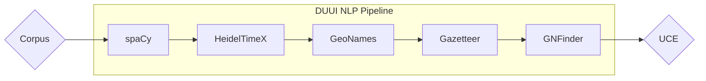

The [BIOfid Specialised Information Service Biodiversity Research project](https://www.biofid.de/de/) uses NLP-centric annotations for historical and contemporary biodiversity literature, which is then made accessible via UCE.

---

## What is BIOfid?

BIOfid is a German specialised information service that provides access to current and historical biodiversity literature and develops technology to mobilise data buried in printed sources. It is a cooperation between University Library J.C. Senckenberg (Frankfurt), Senckenberg Gesellschaft für Naturforschung, and the Text Technology Lab (Goethe University Frankfurt), funded by the DFG. BIOfid runs a text-mining pilot to extract structured biodiversity knowledge from literature-initially focused on birds, butterflies, and vascular plants-and prepares semantic search over the mobilised data through UCE.

---

## NLP Pipeline

The **current** (*10/2025*) NLP pipeline (*implemented in DUUI*) used for the BIOfid project goes as follows:

| Layer           | Description  |
| --------------- | ----------------------------- |
| **Corpus**      | Historical biodiversity literature is digitised and converted via OCR (ABBYY format) to create a machine-readable corpus. The OCR output retains structural metadata such as pages, paragraphs, blocks, and lines, forming the foundational document layout for subsequent NLP annotations. These structures are parsed and aligned during corpus import in DUUI to preserve document hierarchy. |
| **spaCy**       | Provides the core linguistic preprocessing pipeline, including **tokenization**, **part-of-speech tagging**, **lemmatization**, **sentence segmentation**, and **named entity recognition (NER)**. Built on neural transition-based parsing and newer CNN/transformer embeddings, spaCy efficiently handles both modern and historical German and English texts. Its modular pipeline allows integration with custom models or external components like HeidelTimeX and Gazetteer.  🔗 [spaCy Documentation](https://spacy.io/) |
| **HeidelTimeX** | Performs **temporal expression recognition and normalization**, essentially annotating mentions of time and periods. HeidelTimeX is a multilingual, rule-based temporal tagger derived from the original HeidelTime system but extended and additional domain adaptations for the German language. It uses regular expressions and handcrafted pattern rules for temporal phrase detection, coupled with a normalization module that converts relative or vague time expressions into ISO-TimeML standard formats (e.g., `2024-10-21` or `P2Y`).  🔗 [HeidelTimeX Paper](https://arxiv.org/abs/2204.08848) |
| **GeoNames**    | Custom [DUUI component](https://github.com/texttechnologylab/duui-uima/tree/main/duui-geonames-fst) that performs **geographical entity resolution** by linking location mentions (identified by spaCy's NER) to entries in the GeoNames database. Uses fuzzy string matching and heuristic normalization to retrieve metadata such as coordinates, population, and administrative hierarchy. This enriches the corpus with geospatial attributes that can be visualized or filtered in UCE. |
| **Gazetteer**   | Performs **taxon name recognition and linking** using a hybrid of dictionary-based, morphological, and regular-expression methods. Implemented in Rust, the [`gazetteer-rs`](https://github.com/texttechnologylab/gazetteer-rs/) library is optimized for speed and large-scale corpus processing. It loads curated taxonomic name dictionaries and employs trie-based lookups and fuzzy matching to identify scientific names within running text, **especially abbreviations**, and can associate recognized taxa with unique identifiers (e.g., GBIF or BioFID ontology IDs). Its integration in DUUI allows taxon annotations. |
| **GNFinder**    | Executes scientific name detection and normalization based on natural language heuristics and biodiversity nomenclature rules. [GNFinder](https://github.com/gnames/gnfinder) tokenizes text and applies a combination of regular expressions, Bayesian classifiers, and name verification algorithms to identify valid Latin binomials (e.g., *Homo sapiens*). It cross-references results with biodiversity databases (e.g., Catalogue of Life, GBIF, WoRMS) to verify and canonicalize them. GNFinder can disambiguate author abbreviations, hybrid notations, and extinct species marks, returning both normalized names and their taxonomic identifiers. |

!!! info "Additional Annotations"
    Within the BIOfid project, additional tools and NLP tasks have been developed and annotated. The list above represents only the annotations currently available in the UCE BIOfid portal. Further annotations, such as Semantic Role Labeling and more human-centered tools based on newly created ontologies have been created and will be integrated into the UCE portal soon.

## How this translates into UCE

UCE can leverage the various annotations performed on the data to build custom features around them. For example:

* **Geographic queries:**
  UCE uses GeoNames annotations to enable location-based searches. Users can select a point on a map and define a radius, which highlights all pages and documents associated with locations within that area. Additionally, users can filter by GeoNames [classes and codes](https://www.geonames.org/export/codes.html), allowing queries such as `Frog & LOC::T`, which searches for mentions of frogs in association with any type of mountain, hill, rock, etc.

* **Temporal queries:**
  Similarly, time annotations allow users to filter or search within specific dates, ranges, or even seasons (e.g., "winter") using UCE’s boolean search logic (AND, OR, NOT, and more).

* **Taxonomic queries:**
  Taxa annotated by Gazetteer and GNFinder enable filtering based on taxonomic rank (class, family, kingdom, phylum, etc.). These can also be combined with spatial and temporal filters. Furthermore, this allows mapping results onto an interactive 2D map, where detected taxa are grouped by their location and time.

These are just a few examples of how UCE uses annotations for enrichment, search, and visualization-and many more features are available.

---

## UCE and Ontologies

Within the BIOfid project, UCE leverages the SPARQL service to integrate and utilize custom ontologies developed by biologists. The following outlines all operations performed with and on these ontologies within UCE.
All corresponding queries can be found in UCE’s [*JenaSparqlService.java*](https://github.com/texttechnologylab/UCE/blob/main/uce.portal/uce.common/src/main/java/org/texttechnologylab/uce/common/services/JenaSparqlService.java).

| **Operation** | **Description** |
| --------------------- | --------------------------------|
| **Importing**         | During import, UCE reads the UIMA files containing taxa annotated by Gazetteer and GNFinder. Each annotation includes an identifier - either a BIOfid-specific URL or a GBIF identifier. UCE uses this identifier to query the SPARQL ontology, retrieve all vernacular and alternative names for the taxon, and store them in UCE’s database. |
| **Search Enrichment** | When enrichment mode or pro-mode is activated, UCE checks each token against its internal taxa database (previously populated during import with alternative names). If a token is not found, it is not considered a searchable taxon within UCE - though it may still be a taxon outside the system. If it is found, UCE retrieves the unique identifier stored in its database and queries the SPARQL ontology for vernacular names, synonyms, and lower taxonomic ranks (e.g., *subspecies*, *varietas*, *variety*, *forma*, *form*). These enriched tokens are then added to the search with an OR concatenation. It is being considered to remove this additional SPARQL query during search by expanding enrichment during import, so only the UCE database needs to be queried. |
| **Taxon Commands**    | When a user enters a taxon command (e.g., `G::Bellis`), the SPARQL ontology is queried for any entry with the taxonomic rank *Genus* and the scientific name *Bellis*. This returns a unique identifier, which is then used to query the SPARQL database again to retrieve all species where the genus equals that ID. As in the search enrichment, alternative and synonym names are also fetched for each found species. |
| **Layered Search**    | In layered search mode, SPARQL is again used to resolve taxon commands. However, document and page filtering is performed exclusively on the taxa already stored in UCE’s database (imported annotations), rather than via string-based search. This method is not limited by a maximum number of taxa - unlike full-text search - since it operates on structured annotation data instead of complex text queries. |

---

## *JenaSparqlService.java*

Below, you can find the **current** (*10/2025*) queries made to the SPARQL service for this specific BIOfid ontology and project.

<table>
  <thead>
    <tr>
      <th><strong>Method</strong></th>
      <th><strong>Return Type</strong></th>
      <th><strong>Description</strong></th>
    </tr>
  </thead>
  <tbody>

    <tr>
      <td><code>queryBiofidTaxon(String biofidUrl)</code></td>
      <td><code>List&lt;BiofidTaxon&gt;</code></td>
      <td>
        Given a BIOfid taxon URL, retrieves all RDF triples for the subject and converts them into <code>BiofidTaxon</code> objects.
        

          
Query

          <pre><code class="language-sparql">SELECT * WHERE {
  &lt;{SUB}&gt; ?pred ?obj .
}
LIMIT 100</code></pre>
        

      </td>
    </tr>

    <tr>
      <td><code>queryBySubject(String sub)</code></td>
      <td><code>List&lt;RDFNodeDto&gt;</code></td>
      <td>
        Returns all RDF triples (subject, predicate, object) where the given URI is the subject. Filters out generic RDF/OWL predicates.
        

          
Query

          <pre><code class="language-sparql">SELECT * WHERE {
  &lt;{SUB}&gt; ?pred ?obj .
}
LIMIT 100</code></pre>
        

      </td>
    </tr>

    <tr>
      <td><code>getSpeciesIdsOfUpperRank(String rank, String name, int limit)</code></td>
      <td><code>List&lt;String&gt;</code></td>
      <td>
        Fetches all species identifiers under a specified higher taxonomic rank (e.g., Genus → Species). Internally uses <code>getIdsOfTaxonRank()</code> and <code>getSpeciesOfRank()</code>.
      </td>
    </tr>

    <tr>
      <td><code>getIdsOfTaxonRank(String rank, String name)</code></td>
      <td><code>List&lt;String&gt;</code></td>
      <td>
        Returns identifiers (URIs) of all taxa that match a given rank and scientific name. Used to locate parent taxa.
        

          
Query

          <pre><code class="language-sparql">SELECT distinct ?subject WHERE {
  ?subject &lt;http://rs.tdwg.org/dwc/terms/taxonRank&gt; "{RANK}"^^&lt;xsd:string&gt; .
  ?subject &lt;http://rs.tdwg.org/dwc/terms/cleanedScientificName&gt; "{NAME}" .
}
LIMIT 1</code></pre>
        

      </td>
    </tr>

    <tr>
      <td><code>getSpeciesOfRank(String rankName, List&lt;String&gt; ids, int limit)</code></td>
      <td><code>List&lt;String&gt;</code></td>
      <td>
        Given rank identifiers, retrieves all species belonging to them, limited by the specified number.
        

          
Query

          <pre><code class="language-sparql">SELECT DISTINCT ?subject WHERE {
  ?subject &lt;http://rs.tdwg.org/dwc/terms/taxonRank&gt; "species"^^&lt;xsd:string&gt; .
  ?subject &lt;http://rs.tdwg.org/dwc/terms/{RANK}&gt; ?rank .
  VALUES ?rank {
    {IDS}
  }
}
LIMIT {LIMIT}</code></pre>
        

      </td>
    </tr>

    <tr>
      <td><code>getPossibleSynonymIdsOfTaxon(List&lt;String&gt; biofidUrls)</code></td>
      <td><code>List&lt;String&gt;</code></td>
      <td>
        Returns all URIs of taxa marked as <em>synonyms</em> of the provided BIOfid taxon URIs (via <code>dwc:acceptedNameUsageID</code>).
        

          
Query

          <pre><code class="language-sparql">PREFIX dwc: &lt;http://rs.tdwg.org/dwc/terms/&gt;
SELECT ?subject
WHERE {
  ?subject dwc:acceptedNameUsageID &lt;%s&gt; .
  ?subject dwc:taxonomicStatus ?status .
  FILTER(lcase(str(?status)) = "synonym")
}</code></pre>
        

      </td>
    </tr>

    <tr>
      <td><code>getSubordinateTaxonIds(List&lt;String&gt; biofidUrls)</code></td>
      <td><code>List&lt;String&gt;</code></td>
      <td>
        Returns all subordinate taxa (e.g., <em>subspecies</em>, <em>varietas</em>, <em>variety</em>, <em>forma</em>, <em>form</em>) for the given BIOfid URIs.
        

          
Query

          <pre><code class="language-sparql">PREFIX dwc: &lt;http://rs.tdwg.org/dwc/terms/&gt;
SELECT ?subject ?object
WHERE {
  ?subject dwc:parentNameUsageID &lt;%s&gt; .
  ?subject dwc:taxonRank ?object .
  FILTER(lcase(str(?object)) IN ("subspecies", "varietas", "variety", "forma", "form"))
}</code></pre>
        

      </td>
    </tr>

    <tr>
      <td><code>getAlternativeNamesOfTaxons(List&lt;String&gt; biofidIds)</code></td>
      <td><code>List&lt;String&gt;</code></td>
      <td>
        Combines synonym and subordinate taxon lookups to retrieve all vernacular and cleaned scientific names for the given taxa.
        

          
Query

          <pre><code class="language-sparql">SELECT ?subject ?predicate ?object
WHERE {
  VALUES ?subject { {BIOFID_IDS} }
  ?subject ?predicate ?object .
  FILTER(?predicate IN (
    &lt;http://rs.tdwg.org/dwc/terms/vernacularName&gt;,
    &lt;http://rs.tdwg.org/dwc/terms/cleanedScientificName&gt;
  ))
}</code></pre>
        

      </td>
    </tr>

    <tr>
      <td><code>biofidIdUrlToGbifTaxonId(String potentialBiofidId)</code></td>
      <td><code>long</code></td>
      <td>
        Converts a BIOfid taxon URL into its GBIF taxon ID (last numeric segment). Returns <code>-1</code> if none found.
        

          
Query

          <pre><code class="language-sparql">SELECT ?predicate ?object
WHERE {
  &lt;{BIOFID_URL_ID}&gt; &lt;http://rs.tdwg.org/dwc/terms/taxonID&gt; ?object .
}</code></pre>
        

      </td>
    </tr>

  </tbody>
</table>
